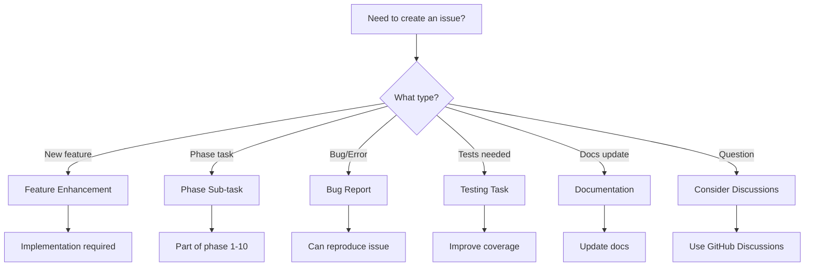

# Issue Templates Guide

This directory contains GitHub issue templates for the question-graph-agent project. These templates help maintain consistency and ensure all necessary information is captured when creating issues.

## Available Templates

### 1. Feature Enhancement (`feature_enhancement.yml`)
Use this template when:
- Proposing new features or enhancements
- Adding new functionality to existing components
- Implementing major improvements

Key sections:
- Implementation phase selection
- Technical approach
- Acceptance criteria
- API changes and examples

### 2. Phase Sub-task (`phase_subtask.yml`)
Use this template when:
- Creating sub-tasks for implementation phases
- Breaking down large phase issues into specific tasks
- Following the phase-based development approach

Naming convention: "Phase X - X.X: Task Description"

### 3. Bug Report (`bug_report.yml`)
Use this template when:
- Reporting unexpected behavior
- Documenting errors or crashes
- Identifying incorrect functionality

Required information:
- Steps to reproduce
- Error output
- Environment details
- Minimal reproducible example

### 4. Testing Task (`testing.yml`)
Use this template when:
- Proposing new tests
- Improving test coverage
- Documenting test scenarios

Covers:
- Unit, integration, and end-to-end tests
- Test scenarios and approach
- Coverage targets

### 5. Documentation (`documentation.yml`)
Use this template when:
- Reporting missing or unclear documentation
- Proposing documentation improvements
- Suggesting new guides or examples

### 6. Question (`question.yml`)
Use this template when:
- You have a question about the project
- **Note**: Consider using [GitHub Discussions](https://github.com/devops-adeel/question-graph-agent/discussions) instead

## Template Selection Guide

## Best Practices

1. **Search First**: Always search existing issues before creating a new one
2. **Be Specific**: Use clear, descriptive titles
3. **Provide Context**: Include all relevant information
4. **Follow Conventions**: Use the established naming patterns
5. **Link Related Issues**: Reference parent issues and dependencies

## Phase-Based Development

This project follows a 10-phase implementation plan:
- Phase 1: Core Entity Models
- Phase 2: Relationship Models
- Phase 3: Entity Extraction
- Phase 4: Graphiti Infrastructure
- Phase 5: Memory Integration
- Phase 6: Temporal Tracking
- Phase 7: Validation & Error Handling
- Phase 8: Query Models
- Phase 9: Migration Utilities
- Phase 10: Testing Infrastructure

When creating sub-tasks, always reference the parent phase issue.

## Labels

Issues are automatically labeled based on the template used:
- `enhancement`: New features and improvements
- `bug`: Bug reports
- `subtask`: Phase sub-tasks
- `testing`: Test-related issues
- `documentation`: Documentation updates
- `question`: Questions (prefer Discussions)

## Need Help?

- For questions: Use [GitHub Discussions](https://github.com/devops-adeel/question-graph-agent/discussions)
- For bugs: Use the Bug Report template
- For features: Use the Feature Enhancement template
- For phase work: Use the Phase Sub-task template